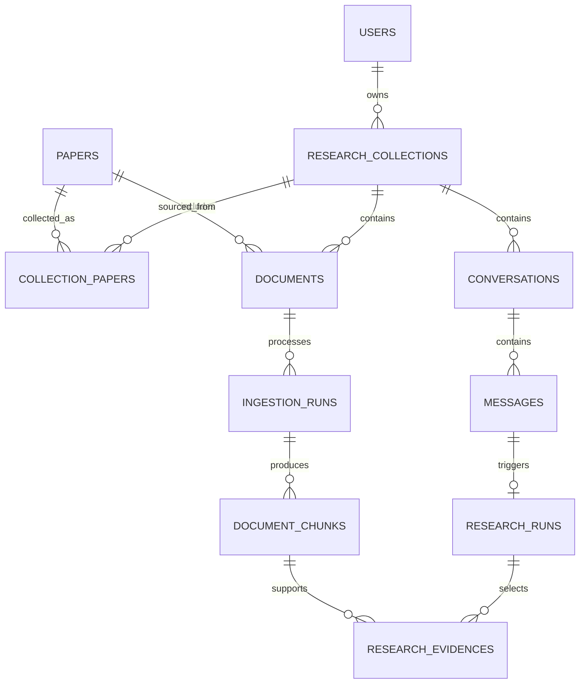

# academic-search 数据库设计讨论稿

状态：SQLAlchemy 模型、严格准入 Alembic 迁移、开放获取直链 PDF 的受控下载暂存、研究集合入库事务与 RAG 入库 Worker 已实现；准入自动投递和 API 业务接口尚未实现。

定位：定义 PostgreSQL 的业务数据模型，以及它与对象存储、Milvus、Redis 的数据边界。首版遵循一个明确前提：**检索结果只是临时候选；只有 DOI 题录核验完成、用户主动选择并且合法正文已实际取得的文献，才写入 PostgreSQL。**

关联：总体架构见 [`01-product-direction-discussion.md`](01-product-direction-discussion.md)；RAG 设计见 [`05-rag-research-workspace-discussion.md`](05-rag-research-workspace-discussion.md)；任务可靠性见 [`06-session-reliability-and-governance-discussion.md`](06-session-reliability-and-governance-discussion.md)。

---

## 1. 设计目标与边界

PostgreSQL 是业务真相来源，保存用户、研究工作区、已确认文献、RAG 文件、入库状态、对话和回答证据。它不保存“尚未确认的检索候选”。

| 存储系统          | 保存内容                                                     | 不保存的内容                     |
| ----------------- | ------------------------------------------------------------ | -------------------------------- |
| PostgreSQL        | 用户、工作区、已验证文献、文件关系、任务状态、对话、回答证据 | PDF 原文件、完整向量值、临时候选 |
| MinIO / OSS / COS | 原始 PDF、HTML、DOCX、解析文本、页级衍生文件                 | 关系数据、权限真相、任务状态     |
| Milvus            | `chunk_id`、向量和检索过滤字段                               | 用户资料、完整文献原文、对话记录 |
| Redis             | arq 队列、缓存、限流、短期搜索结果                           | 任何不可丢失的业务数据           |

本项目不实现付费功能，因此不创建订阅、订单、支付、账单或额度购买相关表。

## 2. 首版入库规则

1. 多源搜索返回的论文只存在于前端页面、Redis 或任务内存中，用户先完成筛选。
2. 用户点击“加入研究集合”时，后端通过 DOI Content Negotiation、Crossref 或 OpenAlex 核对书目信息；必须得到带非空 DOI 的 `ready` 题录。
3. 系统从该格式中立题录生成 **GB/T 7714-2015 顺序编码制** 引文；标题、作者、日期、类型、出处、DOI 与 URL 等关键字段必须无缺失、无冲突。
4. 后端仅对来源明确的开放获取直链 PDF 自动下载，或接收用户有权处理的 PDF；不处理仅有落地页、付费墙或访问受限的候选。
5. 文件通过类型、大小、内容完整性、来源权限和 SHA-256 校验并写入私有暂存区后，准入服务转正对象，并在一个 PostgreSQL 事务中写入 `papers`、`collection_papers`、`documents` 与初始 `ingestion_runs`；任一步失败均补偿清理对象。
6. 准入服务创建状态为 `queued` 的入库运行；`app.workers.ingestion` 消费其 ID 后按 `parse -> chunk -> embed -> index` 推进。只有解析、切块、嵌入与 Milvus 写入全部成功的当前版本才可参与 RAG；自动投递入口仍待 API 层实现。

因此，`papers` 中的每一行都代表“有正式 DOI 题录且已有可处理正文的研究文献”，而不是一个待筛选的搜索结果或只有题录的收藏。无法验证 DOI 题录、未取得正文或全文校验失败的候选在界面中提示具体原因，不创建长期业务记录。

> 首版不维护多份格式化引文缓存，也不创建 `paper_citations` 表。`papers` 保存一份格式中立的、可重新渲染的规范题录字段，`citation_text` 只作为默认 GB/T 展示文本；需要其他格式时由同一份题录生成，而不是从 GB/T 文本反向解析。

## 3. 核心建模原则

1. **研究集合是边界**：每个研究集合就是用户的研究工作区，也是 RAG 的检索范围与权限边界。
2. **题录与正文共同准入**：`papers`、`collection_papers` 与 `documents` 只在 DOI 题录和正文文件均验证成功后共同创建；不保留只有题录的长期论文记录。
3. **文件直接归属工作区**：首版不支持跨工作区复用同一个文件关系。一篇论文被加入两个工作区时，分别在各工作区管理文件与入库状态，换取清晰的权限与删除语义。
4. **入库可恢复**：每次解析、切块、嵌入生成一条 `ingestion_runs`。只有成功运行产生的片段可参与检索。
5. **向量不是业务真相**：Milvus 只保存 `chunk_id` 与向量检索字段。页码、原文、论文和权限始终回 PostgreSQL 校验。

所有主键使用应用层生成的 `UUID`；时间字段使用 `TIMESTAMPTZ` 且统一保存 UTC。状态字段先使用 `VARCHAR(32)` 加 `CHECK` 约束，避免首版频繁修改 PostgreSQL 原生 Enum。`JSONB` 只保存作者列表、模型配置、片段定位信息等不需要按单个字段关联查询的扩展数据。

## 4. 实体关系



## 5. MVP 表设计

### 5.1 用户与研究工作区

#### `users`（用户表）

| 字段                  | 类型           | 约束 / 索引            | 说明                                       |
| --------------------- | -------------- | ---------------------- | ------------------------------------------ |
| `id`                  | `UUID`         | 主键                   | 用户标识                                   |
| `email`               | `VARCHAR(320)` | 大小写无关唯一，可为空 | 本地账号的登录邮箱；匿名 MVP 可为空        |
| `password_hash`       | `VARCHAR(255)` | 可为空                 | 仅保存 Argon2id 密码哈希；OAuth 用户可为空 |
| `password_updated_at` | `TIMESTAMPTZ`  | 可为空                 | 最近一次修改密码的时间                     |
| `email_verified_at`   | `TIMESTAMPTZ`  | 可为空                 | 邮箱验证完成时间                           |
| `display_name`        | `VARCHAR(100)` | 非空                   | 展示名称                                   |
| `status`              | `VARCHAR(32)`  | 索引                   | `active`、`disabled`                       |
| `created_at`          | `TIMESTAMPTZ`  | 非空                   | 创建时间                                   |
| `updated_at`          | `TIMESTAMPTZ`  | 非空                   | 最近更新时间                               |

密码哈希不是密码明文，也不是可逆加密值。邮箱唯一性应通过 `UNIQUE (LOWER(email)) WHERE email IS NOT NULL` 实现。

#### `research_collections`（研究工作区表）

| 字段                        | 类型           | 约束 / 索引           | 说明                            |
| --------------------------- | -------------- | --------------------- | ------------------------------- |
| `id`                        | `UUID`         | 主键                  | 研究集合标识                    |
| `owner_user_id`             | `UUID`         | 外键 `users.id`，索引 | 所有者，也是权限根节点          |
| `name`                      | `VARCHAR(200)` | 非空                  | 工作区名称                      |
| `description`               | `TEXT`         | 可为空                | 用户说明                        |
| `research_question`         | `TEXT`         | 可为空                | 当前研究问题或范围              |
| `status`                    | `VARCHAR(32)`  | 索引                  | `active`、`archived`、`deleted` |
| `created_at` / `updated_at` | `TIMESTAMPTZ`  | 非空                  | 审计时间                        |

建议索引：`(owner_user_id, status, updated_at DESC)`。同一用户允许同名集合，避免因标题临时变化产生不必要限制。

### 5.2 已验证论文与工作区关联

#### `papers`（文献表）

该表只有 DOI 题录与合法正文均已验证的论文，不设置 `candidate`、`excluded` 等候选状态，也不接收无 DOI 的文献。

| 字段                        | 类型           | 约束 / 索引          | 说明                                                           |
| --------------------------- | -------------- | -------------------- | -------------------------------------------------------------- |
| `id`                        | `UUID`         | 主键                 | 规范化论文标识                                                 |
| `doi`                       | `VARCHAR(512)` | 非空，唯一           | 规范化 DOI，小写且移除 `https://doi.org/` 前缀                 |
| `title`                     | `TEXT`         | 非空                 | 论文标题                                                       |
| `authors`                   | `JSONB`        | 非空                 | 有序作者数组，保存 `literal` 或 `given` / `family`，不从引文文本反解析 |
| `abstract`                  | `TEXT`         | 可为空               | 摘要                                                           |
| `publication_year`          | `SMALLINT`     | 索引                 | 发表年份                                                       |
| `publication_month` / `publication_day` | `SMALLINT` / `SMALLINT` | 可为空 | 精确发布日期；只有 DOI 结果具备时写入 |
| `venue`                     | `VARCHAR(500)` | 可为空               | 期刊、会议或预印本平台                                         |
| `paper_type`                | `VARCHAR(64)`  | 可为空               | 统一使用 `journal_article`、`conference_paper`、`preprint` 等内部规范值 |
| `volume` / `issue`          | `VARCHAR(128)` | 可为空               | 卷、期                                                         |
| `pages` / `article_number`  | `VARCHAR(128)` | 可为空               | 页码范围或文章号                                               |
| `publisher`                 | `VARCHAR(500)` | 可为空               | 出版者                                                         |
| `official_url`              | `TEXT`         | 可为空               | 官方落地页或开放获取入口                                       |
| `language`                  | `VARCHAR(16)`  | 可为空               | 主语言，如 `zh`、`en`                                          |
| `citation_text`             | `TEXT`         | 非空                 | 已核验的 GB/T 7714-2015 引文文本                               |
| `citation_provider`         | `VARCHAR(64)`  | 非空                 | `doi_content_negotiation`、`crossref`、`openalex` 或内部生成器 |
| `citation_source_url`       | `TEXT`         | 可为空               | 引文或书目信息的权威来源                                       |
| `citation_verified_at`      | `TIMESTAMPTZ`  | 非空                 | 标题、年份与引文完成核验的时间                                 |
| `created_at` / `updated_at` | `TIMESTAMPTZ`  | 非空                 | 审计时间                                                       |

建议约束：`UNIQUE (doi)`。`papers` 不再使用无 DOI 的 `bibliographic_fingerprint`；无 DOI 候选只能停留在短期检索结果中。

`authors` 的值是保持原始顺序的对象数组，例如 `[{"given":"San","family":"Zhang"},{"literal":"中国科学院"}]`。它来自 DOI Content Negotiation 等结构化书目响应，不从 `citation_text` 反向拆解。首版不支持按作者检索、作者统计或作者实体消歧，因此不创建 `paper_authors` 或全局 `authors` 表。

#### `collection_papers`（工作区文献关联表）

| 字段            | 类型          | 约束 / 索引                    | 说明                 |
| --------------- | ------------- | ------------------------------ | -------------------- |
| `collection_id` | `UUID`        | 外键 `research_collections.id` | 研究工作区           |
| `paper_id`      | `UUID`        | 外键 `papers.id`               | 已验证且已选择的论文 |
| `status`        | `VARCHAR(32)` | 索引                           | `active`、`archived` |
| `tags`          | `TEXT[]`      | 可选 GIN 索引                  | 用户自定义标签       |
| `note`          | `TEXT`        | 可为空                         | 用户笔记             |
| `added_at`      | `TIMESTAMPTZ` | 非空                           | 加入时间             |

主键或唯一约束：`(collection_id, paper_id)`。不存在 `candidate` 或 `excluded` 行，因为未通过校验的候选根本 不进入该表。

### 5.3 文件、入库与向量检索

#### `documents`（文献文件表）

文件直接归属一个研究工作区和一篇已验证论文。这样 RAG 权限查询无需经过额外关联表。

| 字段                | 类型            | 约束 / 索引                          | 说明                                             |
| ------------------- | --------------- | ------------------------------------ | ------------------------------------------------ |
| `id`                | `UUID`          | 主键                                 | 文件资产标识                                     |
| `collection_id`     | `UUID`          | 外键 `research_collections.id`，索引 | RAG 检索和权限边界                               |
| `paper_id`          | `UUID`          | 外键 `papers.id`，索引               | 对应已验证论文                                   |
| `origin_kind`       | `VARCHAR(32)`   | 非空                                 | `user_upload`、`open_access`、`official_download` |
| `original_filename` | `VARCHAR(512)`  | 非空                                 | 原始文件名                                       |
| `media_type`        | `VARCHAR(128)`  | 非空                                 | `application/pdf` 等                             |
| `byte_size`         | `BIGINT`        | 非空                                 | 文件大小                                         |
| `sha256`            | `CHAR(64)`      | `(collection_id, sha256)` 唯一       | 当前工作区内去重与完整性校验                     |
| `object_key`        | `VARCHAR(1024)` | 唯一                                 | MinIO / S3 私有对象键                            |
| `source_url`        | `TEXT`          | 可为空                               | 合法取得来源                                     |
| `access_rights`     | `VARCHAR(32)`   | 非空                                 | `user_upload`、`open_access`、`official_allowed` |
| `created_at`        | `TIMESTAMPTZ`   | 非空                                 | 创建时间                                         |

首版允许同一论文在不同工作区各自拥有文件记录和入库版本；这是有意的简化。跨工作区共享对象与向量只有在出现明确性能需求后再设计。`origin_kind=open_access` 仅在直链 PDF 实际校验成功后使用；首版不自动产生 `official_download`。

#### `ingestion_runs`（文献入库运行表）

| 字段                             | 类型                   | 约束 / 索引               | 说明                                                    |
| -------------------------------- | ---------------------- | ------------------------- | ------------------------------------------------------- |
| `id`                             | `UUID`                 | 主键                      | 一次可重试的入库尝试                                    |
| `document_id`                    | `UUID`                 | 外键 `documents.id`，索引 | 处理目标                                                |
| `arq_job_id`                     | `VARCHAR(128)`         | 唯一，可为空              | Redis arq 任务关联标识                                  |
| `pipeline_version`               | `VARCHAR(64)`          | 非空                      | 解析、切块、索引流程版本                                |
| `status`                         | `VARCHAR(32)`          | 索引                      | `queued`、`running`、`completed`、`failed`、`cancelled` |
| `stage`                          | `VARCHAR(32)`          | 索引                      | `parse`、`chunk`、`embed`、`index`                      |
| `parser_name` / `parser_version` | `VARCHAR(128)`         | 可为空                    | 解析器可追溯信息                                        |
| `chunking_config`                | `JSONB`                | 非空                      | 分块配置                                                |
| `embedding_config`               | `JSONB`                | 非空                      | 模型、维度、批处理参数                                  |
| `statistics`                     | `JSONB`                | 非空，默认 `{}`           | 页数、片段数、耗时等统计                                |
| `error_code` / `error_message`   | `VARCHAR(64)` / `TEXT` | 可为空                    | 可显示且可重试的失败原因                                |
| `attempt_no`                     | `SMALLINT`             | 非空                      | 同一流程版本的重试序号                                  |
| `is_current`                     | `BOOLEAN`              | 非空，部分唯一约束         | 当前可参与 RAG 的成功入库版本                           |
| `started_at` / `finished_at`     | `TIMESTAMPTZ`          | 可为空                    | 执行时间                                                |
| `created_at`                     | `TIMESTAMPTZ`          | 非空                      | 投递时间                                                |

建议唯一约束：`(document_id, pipeline_version, attempt_no)`；建议索引：`(status, created_at)`；另加部分唯一约束 `UNIQUE (document_id) WHERE is_current`。RAG 检索时仅使用 `is_current=true AND status='completed'` 的运行产生的片段。新版本完成后才原子切换当前标记并清理旧向量，避免不同版本混合召回。

#### `document_chunks`（文献分块表）

| 字段                      | 类型       | 约束 / 索引                        | 说明                                      |
| ------------------------- | ---------- | ---------------------------------- | ----------------------------------------- |
| `id`                      | `UUID`     | 主键                               | 稳定的可引用片段 ID，也是 Milvus 主键来源 |
| `ingestion_run_id`        | `UUID`     | 外键 `ingestion_runs.id`，索引     | 所属入库版本                              |
| `parent_chunk_id`         | `UUID`     | 自关联外键，可为空，索引           | 直接父块                                  |
| `root_chunk_id`           | `UUID`     | 自关联外键，可为空，索引           | L1 根块                                   |
| `level`                   | `SMALLINT` | 检查 `1..3`，索引                  | L1、L2、L3 层级                           |
| `ordinal`                 | `INTEGER`  | `(ingestion_run_id, ordinal)` 唯一 | 在当前入库版本中的顺序                    |
| `content`                 | `TEXT`     | 非空                               | 原文片段；引用与展示的真相来源            |
| `token_count`             | `INTEGER`  | 非空                               | 模型相关 token 统计                       |
| `page_start` / `page_end` | `INTEGER`  | 可为空                             | 页码范围                                  |
| `section_path`            | `TEXT[]`   | 可为空                             | 章节层级                                  |
| `locator`                 | `JSONB`    | 非空，默认 `{}`                    | 页内坐标、段落号、原文锚点等              |
| `content_sha256`          | `CHAR(64)` | 索引                               | 判断片段变化与调试版本差异                |

只向 Milvus 写入 L3 片段。首版不创建 `chunk_vector_indexes`：向量索引状态由 `ingestion_runs.status` 表示，Milvus 主键固定为 `document_chunks.id`。需要同时维护多套 embedding 模型时，再增加该表。

### 5.4 对话、研究运行与回答证据

#### `conversations`（对话表）

| 字段                        | 类型           | 约束 / 索引                          | 说明                            |
| --------------------------- | -------------- | ------------------------------------ | ------------------------------- |
| `id`                        | `UUID`         | 主键                                 | 对话标识                        |
| `collection_id`             | `UUID`         | 外键 `research_collections.id`，索引 | 对话的检索边界                  |
| `owner_user_id`             | `UUID`         | 外键 `users.id`，索引                | 发起用户                        |
| `title`                     | `VARCHAR(300)` | 可为空                               | 自动生成或用户编辑的会话标题    |
| `status`                    | `VARCHAR(32)`  | 索引                                 | `active`、`archived`、`deleted` |
| `created_at` / `updated_at` | `TIMESTAMPTZ`  | 非空                                 | 审计时间                        |

#### `messages`（消息表）

| 字段              | 类型          | 约束 / 索引                   | 说明                                          |
| ----------------- | ------------- | ----------------------------- | --------------------------------------------- |
| `id`              | `UUID`        | 主键                          | 消息标识                                      |
| `conversation_id` | `UUID`        | 外键 `conversations.id`，索引 | 所属会话                                      |
| `role`            | `VARCHAR(16)` | 索引                          | `user`、`assistant`、`system`                 |
| `content`         | `TEXT`        | 非空                          | 消息正文                                      |
| `status`          | `VARCHAR(32)` | 索引                          | `pending`、`streaming`、`completed`、`failed` |
| `metadata`        | `JSONB`       | 非空，默认 `{}`               | 仅保存展示扩展，不保存证据真相                |
| `created_at`      | `TIMESTAMPTZ` | 非空                          | 创建时间                                      |

#### `research_runs`（研究运行表）

| 字段                           | 类型                   | 约束 / 索引                          | 说明                                                                              |
| ------------------------------ | ---------------------- | ------------------------------------ | --------------------------------------------------------------------------------- |
| `id`                           | `UUID`                 | 主键                                 | 一次 RAG 或 Agent 执行                                                            |
| `collection_id`                | `UUID`                 | 外键 `research_collections.id`，索引 | 执行范围                                                                          |
| `input_message_id`             | `UUID`                 | 外键 `messages.id`，唯一             | 触发问题                                                                          |
| `output_message_id`            | `UUID`                 | 外键 `messages.id`，可为空           | 最终回答或澄清消息                                                                |
| `mode`                         | `VARCHAR(32)`          | 索引                                 | `single_rag`、`multi_agent`、`research_note`                                      |
| `status`                       | `VARCHAR(32)`          | 索引                                 | `queued`、`running`、`awaiting_clarification`、`completed`、`failed`、`cancelled` |
| `langgraph_thread_id`          | `VARCHAR(128)`         | 唯一，可为空                         | LangGraph checkpoint 关联标识                                                     |
| `model_config`                 | `JSONB`                | 非空                                 | 模型、提示词版本与参数快照                                                        |
| `retrieval_trace`              | `JSONB`                | 非空，默认 `{}`                      | 查询改写、候选规模、重排等可审计摘要                                              |
| `error_code` / `error_message` | `VARCHAR(64)` / `TEXT` | 可为空                               | 失败信息                                                                          |
| `started_at` / `finished_at`   | `TIMESTAMPTZ`          | 可为空                               | 执行时间                                                                          |
| `created_at`                   | `TIMESTAMPTZ`          | 非空                                 | 创建时间                                                                          |

#### `research_evidences`（回答证据表）

| 字段               | 类型               | 约束 / 索引                     | 说明                                        |
| ------------------ | ------------------ | ------------------------------- | ------------------------------------------- |
| `id`               | `UUID`             | 主键                            | 一条候选或最终引用证据                      |
| `research_run_id`  | `UUID`             | 外键 `research_runs.id`，索引   | 所属研究运行                                |
| `chunk_id`         | `UUID`             | 外键 `document_chunks.id`，索引 | 原始证据片段                                |
| `selection_stage`  | `VARCHAR(32)`      | 索引                            | `vector`、`rrf`、`rerank`、`final_citation` |
| `rank`             | `INTEGER`          | 可为空                          | 当前阶段排名                                |
| `vector_score`     | `DOUBLE PRECISION` | 可为空                          | 向量召回分数                                |
| `rrf_score`        | `DOUBLE PRECISION` | 可为空                          | 融合分数                                    |
| `rerank_score`     | `DOUBLE PRECISION` | 可为空                          | 精排分数                                    |
| `is_cited`         | `BOOLEAN`          | 索引                            | 是否进入最终回答                            |
| `citation_excerpt` | `TEXT`             | 可为空                          | 回答当时展示的原文片段快照                  |
| `locator_snapshot` | `JSONB`            | 可为空                          | 页码、章节等定位快照                        |
| `created_at`       | `TIMESTAMPTZ`      | 非空                            | 记录时间                                    |

最终回答中的每个事实主张应至少关联一条 `is_cited=true` 的证据。每条证据可通过 `chunk_id -> ingestion_run -> document -> paper` 回查论文的已验证引文。

## 6. Milvus 元数据契约

Milvus 只保存 L3 片段的向量和检索所需字段。

| 字段               | 来源                                 | 用途                          |
| ------------------ | ------------------------------------ | ----------------------------- |
| `chunk_id`         | `document_chunks.id`                 | 主键，检索结果回查 PostgreSQL |
| `collection_id`    | `documents.collection_id`            | 第一层研究工作区过滤          |
| `owner_user_id`    | `research_collections.owner_user_id` | 第一层用户隔离过滤            |
| `document_id`      | `documents.id`                       | 文献删除与版本过滤            |
| `ingestion_run_id` | `ingestion_runs.id`                  | 仅召回当前成功版本            |
| `level`            | `document_chunks.level`              | 固定为 L3，便于防御性校验     |
| `embedding`        | Worker 生成                          | 向量相似度检索                |

Milvus 过滤不是权限真相。API 必须在创建检索表达式前校验用户对 `collection_id` 的权限；获得 `chunk_id` 后，在读取原文和生成答案前再次通过 PostgreSQL 校验工作区、文件和入库版本。

## 7. 后端数据库代码组织

数据库相关的 Python 代码统一位于 `backend/app/db/`，迁移文件保留在 `backend/alembic/`。不要把 SQLAlchemy 模型定义写进 FastAPI 路由、Pydantic 请求响应模型，或 Docker 基础设施目录。

```text
backend/
├─ app/
│  ├─ db/
│  │  ├─ __init__.py
│  │  ├─ base.py                 # SQLAlchemy Declarative Base 与共享列定义
│  │  ├─ session.py              # 异步 Engine、SessionFactory 和数据库依赖
│  │  └─ models/
│  │     ├─ __init__.py          # 集中导入所有模型，供 Alembic 发现 metadata
│  │     ├─ user.py              # users
│  │     ├─ collection.py        # research_collections、collection_papers
│  │     ├─ paper.py             # papers
│  │     ├─ document.py          # documents、ingestion_runs、document_chunks
│  │     ├─ research.py          # conversations、messages、research_runs、research_evidences
│  │     └─ workflow.py          # research_plans、search_runs
│  ├─ schemas/                   # Pydantic 请求 / 响应 DTO，不等同数据库模型
│  ├─ services/                  # 文献校验、入库、RAG 等业务逻辑
│  └─ api/                       # FastAPI 路由
└─ alembic/
   ├─ env.py                     # 加载 app.db.models 的 metadata
   └─ versions/                  # 每次表结构变更的迁移文件
```

首版按业务领域拆分模型文件，而不是把全部模型堆进一个 `models.py`。`schemas` 与 `models` 必须分开：前者定义 API 的输入输出，后者定义 PostgreSQL 表和外键。服务层负责“DOI 题录与正文均验证成功后才入库”等业务规则，路由层只调用服务并返回响应。

已实现的数据库基础设施包括 `app/db/base.py`、`app/db/session.py`、`app/db/models/`、`alembic/env.py` 与五条迁移：初始建表、schema 注释、严格准入同步、研究工作流状态和工作流唯一约束校正。最新 revision `f41c8e7b2a06_align_workflow_unique_constraints` 使 `arq_job_id`、`redis_session_key` 的数据库唯一约束与 SQLAlchemy 模型保持一致；其前一条 revision `e2a7c4b9d113_add_research_workflow_models` 为工作区增加独立 `workflow_stage`，并创建 `research_plans`、`search_runs`。候选详情仍不写入 PostgreSQL，而只在 Redis TTL 内保存，防止未通过 DOI 与全文准入的数据混入 `papers`。`d7a4c9e2f18b_align_research_document_admission` 已将 `papers.doi` 改为非空唯一、移除 `bibliographic_fingerprint`、补齐格式中立题录字段，并同步 `documents.origin_kind` 与 `ingestion_runs.is_current`。`app/modules/fulltext` 将合法获取的 PDF 写入私有暂存键；`app/modules/collections/ResearchCollectionAdmissionService` 已在验证候选、题录、全文和工作区权限后，以可补偿流程转正对象，并在一个事务中写入长期书目、集合关联、文件和初始入库运行。`app.workers.ingestion` 已实现消费该运行的解析、切块、embedding 和 Milvus 写入；准入服务尚未接入 HTTP API 或自动 arq 投递，后续接口必须消费这条既有准入边界，不能绕过或修改初始迁移。

## 8. 首批 Alembic 迁移顺序

初始迁移 `105ffabed7bc_create_initial_schema` 创建 11 张核心表；之后通过独立 revision 逐步演进，不能修改初始迁移。研究入口闭环新增 `research_plans`、`search_runs` 两张运行状态表，因此当前模型共 13 张表。

| 逻辑层                   | 包含表                                                             | 目的                             |
| ------------------------ | ------------------------------------------------------------------ | -------------------------------- |
| 用户、工作区与已验证书目 | `users`、`research_collections`、`papers`、`collection_papers`     | 建立用户、工作区与已验证书目     |
| 文件与入库               | `documents`、`ingestion_runs`、`document_chunks`                   | 支持异步解析、分块与 Milvus 写入 |
| 对话与研究               | `conversations`、`messages`、`research_runs`、`research_evidences` | 支持可引用 RAG 问答和恢复状态    |
| 研究入口与检索运行       | `research_plans`、`search_runs`                                    | 支持计划确认、任务恢复与检索进度 |

为匹配“输入要求 -> 计划确认 -> 多源检索 -> 统一结果”的前端流程，首版新增轻量 `search_runs`，但不创建 `search_candidates`：长期数据库只保留运行状态、统计、错误与 Redis 会话键；标题、摘要、来源原始记录和可审核候选在 `SEARCH_SESSION_TTL_SECONDS` 内存放于 Redis，到期后变为可再生数据。`paper_identifiers`、`paper_authors`、`paper_source_records`、`citation_validations`、`collection_documents` 和 `chunk_vector_indexes` 仍不创建，避免把尚未出现的检索审计和多版本索引需求提前复杂化。

## 9. 后续扩展条件

| 出现的实际需求                     | 再增加的表或调整                                                        |
| ---------------------------------- | ----------------------------------------------------------------------- |
| 需要按样式、语言或版本缓存大量引用文本 | 再增加 `paper_citations`，按论文、样式和语言缓存；首版直接从 `papers` 的格式中立字段生成 |
| 要求审计每一次来源调用与被拒绝候选 | 增加 `search_provider_runs`、`search_candidates`，扩展现有 `search_runs` |
| 同一文件跨工作区复用且避免重复解析 | 恢复 `collection_documents`，并重新定义对象和向量的共享策略             |
| 同时维护多种 embedding 模型        | 增加 `chunk_vector_indexes`，按片段和索引版本记录状态                   |
| 需要完整的多 Agent 节点可视化      | 增加 `agent_run_steps`，关联 `research_runs`                            |

## 10. 待决定的问题

1. MVP 是否在创建研究集合前就要求登录，还是允许匿名搜索后再绑定用户？
2. 用户删除工作区时，PDF、解析产物、Milvus 向量是立即物理删除，还是先软删除并异步清理？
3. 首版 `research_evidences` 是否保存完整的召回和重排候选，还是只保存最终引用？
