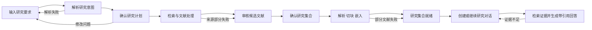

# 前端交互流程讨论稿

状态：交互契约、Vue 主流程、候选审核工作台与 RAG 对话均已实现；认证、工作区、计划确认、检索、分页审核、正式引用、全文核验、集合构建和研究会话已接入真实 API。检索运行画布已消费 SSE 的真实相关性进度并支持断流后的手动重连；候选审核已通过浏览器流程和真实 arXiv Worker 专项验收。

## 1. 目标

前端的核心不是把“任务解析、文献筛选、证据研究”并列成三个功能页，而是让用户在一个工作区内持续推进同一项研究。页面必须持续回答三个问题：

1. 我正在处理哪个研究任务？
2. 系统现在在做什么，我需要做什么？
3. 下一步何时可用，为什么暂时不可用？

工作区是研究任务的边界。文献集合属于工作区，研究会话属于工作区内的集合。用户不能在没有可问答集合时进入研究对话，也不能把未确认或全文不可用的文献作为 RAG 证据。

## 2. 核心对象与状态

| 对象         | 用户可见含义                          | 前端必须持有的状态                                                                                             |
| ------------ | ------------------------------------- | -------------------------------------------------------------------------------------------------------------- |
| 工作区       | 一项研究任务及其全部历史              | `draft`、`analyzing`、`plan_review`、`retrieving`、`screening`、`collection_building`、`researching`、`failed` |
| 研究计划     | 对输入问题的可编辑解释                | 方向、时间范围、语言、检索表达、固定准入规则、是否已确认                                                       |
| 文献处理任务 | 多个来源的检索、规整、核验和全文获取  | 每个来源的状态、处理阶段、可重试错误、候选数量                                                                 |
| 候选审核     | 当前结果中的审阅焦点与临时准备选择    | 前端焦点、服务端分页游标、Redis 准备清单摘要与全文短期状态                                                     |
| 研究集合     | 当前工作区中可作为 RAG 证据的全文集合 | `empty`、`awaiting_confirmation`、`indexing`、`ready`、`partial_failure`                                       |
| 研究会话     | 在同一集合中连续追问的一段上下文      | 标题、集合范围、消息序列、每条回答的执行状态与引用                                                             |

工作区阶段由服务端任务状态决定。前端只展示稳定的执行状态，不能从模型生成文本推断阶段。

## 3. 主路径

阶段轨只表达进度和可回看状态，不作为任意跳转的导航：

- 已完成阶段可以回看，但重新确认计划会创建新的检索任务，不能静默覆盖已完成结果。
- 当前阶段只展示当前动作和必要的次级动作。
- 后续阶段必须显示锁定原因，并在满足条件后自动解锁。

## 4. 页面契约

实现中，`/` 与 `/workspace/:workspaceId/run` 共同承载同一个输入驱动的研究画布：提交后 URL 会补充可恢复的工作区标识，但页面不切换为带侧栏的平级“计划页”或“检索页”。旧的 `/plan`、`/search` 地址仅保留为兼容性重定向。

| 页面                    | 主要动作                                         | 进入条件                 | 成功结果                                                     | 失败或返回路径                                                    |
| ----------------------- | ------------------------------------------------ | ------------------------ | ------------------------------------------------------------ | ----------------------------------------------------------------- |
| `01-research-entry`     | 输入研究要求，开始分析                           | 至少有一段非空研究要求   | 创建工作区草稿并切换到解析状态                               | 行内提示缺少研究要求；可返回输入继续修改                          |
| `02-intent-confirm`     | 修改并确认研究计划                               | 解析已生成计划草稿       | 固化时间、语言和检索计划，启动检索任务                       | 无法确认时保留编辑内容；修改原问题返回入口页                      |
| `03-literature-results` | 审核记录，建立准备清单并进入核验任务             | 至少有一条候选记录       | 复选框更新准备清单，工具条进入核验任务页                     | 无可入集合文献时给出补充范围、重试处理或上传全文入口              |
| `03a-verification-task` | 跟踪题录与全文核验，并把已通过项交接到待确认集合 | 准备清单未过期           | 只将当前可准入项加入待确认集合，其余继续核验                 | 会话过期时返回候选审核；失败项保留原因和重试入口                  |
| `08-paper-detail`       | 查看、复制引用、发起单篇核验                     | 候选文献存在             | 单篇核验会同步加入准备清单，已通过项跳转核验任务页完成入集合 | 未满足 DOI 或全文条件时禁用入库，保留查看和复制题录               |
| `04-research-workspace` | 查看集合与索引，进入对话                         | 集合已创建               | `ready` 后解锁研究对话                                       | `indexing` 显示进度；`partial_failure` 显示失败文献与返回筛选入口 |
| `09-research-chat`      | 创建会话、提问、查看引用                         | 集合至少有一篇已索引全文 | 新增用户问题和带引用回答                                     | 证据不足要求补充问题或集合范围；执行失败可重试                    |

检索运行画布不单独成为一张静态“等待页”，而是工作区在 `retrieving` 阶段的实时状态。它按顺序呈现“多源检索、记录规整、去重与初筛、相关性判断、题录补全”，其中相关性判断直接显示后端发布的真实完成数和总数。每条 SSE 消息更新当前说明与最近更新时间；若运行中连续 15 秒未收到事件，前端显示可理解的延迟提示并只提供“重新连接”以核对当前任务，不生成虚假的百分比、剩余时间或模型思维过程。

## 5. 关键交互规则

### 5.1 创建工作区与任务解析

首页在提交时先创建一个 `draft` 工作区，并保留原始研究要求。解析过程在原位推进，避免用户被带到空白页。解析完成后用户只需要确认研究方向、时间范围和语言；研究对象、关系、同义表达和固定准入由系统提出，但必须可返回修改。

确认计划后，按钮立即进入不可重复提交状态，并把工作区推进为 `retrieving`。用户离开页面后可以通过工作区切换器看到任务仍在运行，并直接进入它当前阶段；返回后恢复服务端最新状态，而不是重播本地动画。

### 5.2 文献筛选与集合确认

结果页将四层状态严格分开：正在查看是浏览器检查器焦点；本次准备清单是归属当前 `search_run` 的 Redis 临时选择；待确认集合是 PostgreSQL 中已完成 DOI、题录和全文准入的文献；可研究集合则是完成索引后的 RAG 范围。点击一行只能改变正在查看，复选框才更新本次准备清单。

审核流程分为四个明确动作：

1. 用户跨页勾选候选，建立本次准备清单。只有通过基础初筛且具有 DOI 的候选可以加入；关键词、语言、优先级和“只看已选”都由服务端分页处理。
2. 用户点击“核验任务”进入独立页面。该页显示准备清单、题录与全文核验、待确认集合三者的真实交接状态，并在用户点击“开始核验”后逐篇投递既有全文 Worker；Worker 按需补齐题录、下载并校验开放获取 PDF。自动刷新只读取服务端状态，任务投递不等于全文已经可用。
3. 用户在核验任务页点击“加入待确认集合”。系统只把已验证全文和正式题录均就绪的候选写入 PostgreSQL；未完成或受阻项保留在本次准备清单，已通过项不必等待整批结束。单篇详情页不能绕过这个边界：它发起核验时会同步加入准备清单，通过后同样引导到核验任务页。
4. 待确认集合的数量更新后，用户点击“确认并构建集合”；前端展示不可逆影响和将执行的解析、切块、嵌入步骤，再次确认才启动异步任务。

不能把“选中 8 篇”直接等同于“已可研究”。在集合构建完成前，研究对话入口保持锁定，并明确显示当前正在处理的阶段。部分文献失败时，其余已完成索引的文献可构成可用集合，但必须显示实际可问答范围。

### 5.3 论文详情

详情页是审查单篇候选记录的地方，不应脱离当前工作区。全文动作根据准入状态呈现三种行为：

- 可加入：引导至核验任务页加入待确认集合，不在详情页绕过批次交接。
- 已在集合：显示当前索引状态，并提供“从集合移除”。
- 不可加入：禁用按钮并说明缺少 DOI、正式题录或可处理全文中的哪一项。

复制引用、打开出版页和查看 PDF 是独立动作，不改变集合状态。

### 5.4 研究集合与研究对话

集合页负责管理范围和处理状态，对话页负责连续研究，二者不堆在同一画布中。集合页的“进入研究对话”仅在 `ready` 或 `partial_failure` 且可问答文献数大于零时可用。

对话发送后按顺序经历：用户问题写入消息流、`hybrid_retrieval`、`parent_merging`、`reranking`、`evidence_verifying`、带引用回答或证据不足。执行状态显示在当前问题下方，不展示模型内部思维链。原型不能生成真实结论时，必须明确写出“仅演示执行状态”，而不是伪造一段看似可信的研究回答。

每条助手回答的引用来源和检索过程属于该回答本身。点击文内标号应展开并定位同一条回答的原文片段；不应跳转到全局常驻面板。

### 5.5 会话与工作区导航

工作区切换器只负责切换研究任务，不设置独立的工作区列表中转页。切换器顶部保留当前工作区和搜索框，默认优先展示最近使用的工作区；搜索同时匹配工作区名称和当前阶段，结果列表限高并在自身容器内滚动，空结果时给出继续搜索的提示。选择后直接进入该任务的当前阶段。正式接口使用关键词和游标分页按需加载，前端不一次性拉取或平铺全部工作区。研究对话页侧栏只显示当前工作区内的会话历史。新建会话默认继承当前集合范围；用户只有在明确操作时才改变工作区或集合范围。

窄屏不保留桌面会话侧栏，而是在顶部提供工作区切换与会话入口。任何隐藏为图标的操作都必须保留 `aria-label` 和悬停提示。

## 6. 反馈与恢复

| 场景                   | 页面反馈                                               | 用户可执行动作                                             |
| ---------------------- | ------------------------------------------------------ | ---------------------------------------------------------- |
| 文献源部分失败         | 显示失败来源、影响的阶段和已完成数据                   | 重试该来源，继续审核现有记录，调整范围后重新检索           |
| 检索进度暂未更新       | 保留当前真实候选数和阶段，说明暂未收到新事件           | 重新连接进度流确认状态，不重复创建检索任务                 |
| 无可入集合文献         | 解释未通过的是全文、DOI 还是题录条件                   | 放宽时间或语言，上传有权处理的全文，返回修改计划           |
| 集合索引部分失败       | 显示成功数量和失败文献                                 | 用现有集合开始研究，查看失败原因，返回结果页替换文献       |
| RAG 证据不足           | 明示当前集合没有足够证据支持结论                       | 补充问题，选择限定到单篇文献，返回集合扩大范围             |
| 页面刷新或重新进入     | 从服务端重新读取工作区、任务、集合与会话状态           | 恢复当前阶段，不重新播放已完成动画                         |
| 搜索会话或准备清单过期 | 明确说明候选与临时选择已过期，不把它误显示为集合被清空 | 重新执行同一确认计划的检索；已在待确认集合中的文献保持不变 |

## 7. 原型实施边界

静态原型可使用 `localStorage` 和定时事件模拟用户侧状态及服务端推送，但必须遵守以下边界：

- 本地状态只用于展示“选择、确认、处理中、完成、失败”等交互，不伪造真实论文、模型回答或检索结果。
- 跳转页之间使用明确的状态键或查询参数交接，不让按钮只显示 toast 后失去后续。
- 所有长任务均可在离开后返回查看状态；正式实现改由 TanStack Query、WebSocket 或 SSE 与后端任务状态同步。
- 原型样例工作区可使用不同主题，但跨页面跳转必须保持同一工作区身份和集合范围。

## 8. 后续接口映射

Vue 实现时，页面不直接编排后端任务。建议由以下资源驱动：

- `workspace`：工作区摘要、当前阶段和权限。
- `research-plan`：输入要求、解析结果、确认版本和检索范围。
- `search-run`：来源任务、候选集合、处理进度和错误。
- `candidate-review`：分页候选、当前页全文状态、本次准备清单和批量准备/准入结果。
- `research-collection`：纳入记录、集合构建任务、可问答范围。
- `research-session`：会话列表、消息流、回答的引用和执行轨迹。

详情页、集合页和对话页共享同一工作区与集合标识。前端路由参数只标识资源，不携带可被篡改的准入状态或索引结果。
